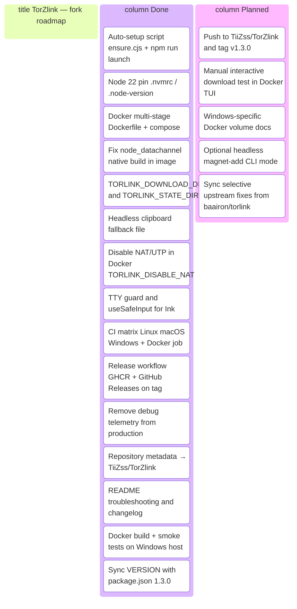

<p align="center">
  
</p>

Finding a torrent these days sucks. One site is a minefield of fake download buttons. Another hides the real link under a popup that spawns two more tabs. And after all that, half the results are dead, zero seeders.

torlink is a torrent finder that lives in your terminal, with zero setup and nothing to configure. One search checks a short, curated list of reputable sources at once, and whatever you pick downloads straight to your computer. The files are yours, saved to your downloads folder.

> **This repository** — [TiiZss/TorZlink](https://github.com/TiiZss/TorZlink) is a maintained fork of [baairon/torlink](https://github.com/baairon/torlink). Same TUI and sources; this fork adds Docker, auto-setup for developers, CI, and fixes for headless/container environments. See [Differences from upstream](#differences-from-upstream) and the [Changelog](CHANGELOG.md).

## Get started

1. **Install Node** (from [nodejs.org](https://nodejs.org)), it's all torlink needs.
2. **Open your terminal.**
3. **Start it:**

   ```sh
   npx torlnk
   ```

That's the only thing you'll type. torlink opens straight to a search bar: search for what you want, paste in a magnet link or a bare infohash, or just press Enter on an empty box to browse the curated library. From there it's all keypresses, nothing to memorize, and `?` brings up the full list anytime.

## Finding something

Type what you're looking for and press Enter. Results stream in from every source as they answer, tagged with size and how many people are sharing each one, so you can see what'll come down fast. Arrow to what you want and press `d` to save it, or `shift+d` to pick a different folder for just that download.

<p align="center">
  
</p>

## Your downloads

Active downloads sit up top with their progress, speed, and time left; when one finishes it drops into Recently downloaded just below, so the list stays tidy. Everything's still there when you come back, and anything interrupted picks up where it left off.

Downloads run in the background while you keep searching, so you can queue up as many as you want. They save to your downloads folder, and the Downloads pane keeps tabs on each one; press `o` anytime to change where that is, or grab one result with `shift+d` to send it somewhere else without touching the default. When something finishes it keeps seeding automatically so the next person can find it too, and the Seeding tab lets you pause or stop that anytime.

<p align="center">
  
</p>

## What it searches

A short, hand-picked list of trusted sources:

| Category | Sources |
| --- | --- |
| Games | FitGirl |
| Movies | YTS, The Pirate Bay, 1337x |
| TV | EZTV, The Pirate Bay, 1337x |
| Anime | Nyaa, SubsPlease |

Games are the only category that can run code, so they come from FitGirl alone, a repacker with a long, trusted track record; everything else is plain video and subtitles. If a source is down, the search carries on without it, and torlink tells you which one is offline.

## Differences from upstream

Fork of [baairon/torlink](https://github.com/baairon/torlink). Core behaviour (search, download, seed, UI) is unchanged unless noted.

| Area | Upstream (`baairon/torlink`) | This fork (`TiiZss/TorZlink`) |
| --- | --- | --- |
| **Run locally** | `npm install` then `npm run dev` | `npm run launch` + auto `ensure` on `dev`/`start` (Node check, install, update deps) |
| **Node version** | Documented ≥ 22 | `.nvmrc` / `.node-version` + enforced in `ensure.cjs` |
| **Docker** | Not provided | Multi-stage image, `docker-compose.yml`, `npm run docker:run` |
| **Download directory** | OS default only | `TORLINK_DOWNLOAD_DIR` env override (required for Docker volumes) |
| **State / config dir** | `env-paths` default | `TORLINK_STATE_DIR` override |
| **Clipboard (copy magnet)** | OS clipboard (`xclip`, etc.) | Same + **file fallback** at `$TORLINK_STATE_DIR/clipboard.txt` when headless |
| **WebTorrent in Docker** | N/A | NAT-PMP, UPnP, uTP disabled (`TORLINK_DISABLE_NAT` / `/.dockerenv`) to avoid crashes |
| **TTY / Ink** | Assumes interactive terminal | Startup check + `useSafeInput`; clear message if `-it` missing |
| **CI** | Upstream workflow | Matrix: Linux, macOS, Windows + Docker build |
| **Self-update** | npm package update on `torlnk` binary | Same for published binary; `TORLNK_SKIP_UPDATE=1` in Docker/CI |
| **Repository** | `baairon/torlink` | `TiiZss/TorZlink` |

Full version history: [CHANGELOG.md](CHANGELOG.md).

## Contributing

To run or work on torlink locally:

1. Clone the repository and open the folder:

   ```sh
   git clone https://github.com/TiiZss/TorZlink
   cd TorZlink
   ```

2. **Use Node 22+** (`.nvmrc` / `.node-version` are included for nvm, fnm, or volta).
3. Launch with auto-setup (installs and updates dependencies on every start):

   ```sh
   npm run launch
   ```

   Or the classic flow:

   ```sh
   npm install
   npm run dev
   ```

   `npm run dev` and `npm start` also run the ensure step automatically (`predev` / `prestart`), which checks Node, installs missing packages, and updates outdated ones. Set `TORLNK_SKIP_UPDATE=1` to skip updates (useful in CI).

4. Or build it and run the bundled version:

   ```sh
   npm run build
   npx torlnk
   ```

   The `torlnk` binary checks for newer releases on startup and updates itself when possible.

### Docker

Interactive TUI (downloads persist in `./downloads`, state in a named volume):

```sh
docker compose build
npm run docker:run
```

(`docker:run` adds the required `-it` flags. Without them Ink cannot read keyboard input.)

**Docker Desktop:** `docker compose run --rm` creates a one-off container (name like `torlink-torlnk-run-…`) that only appears under **Containers** while the TUI is running. When you quit or the app exits, `--rm` removes it immediately — that is expected, not a bug.

Build the image manually (tags it as `torlnk:latest`):

```sh
docker build -t torlnk:latest .
docker run --rm -it \
  -e TORLINK_STATE_DIR=/data \
  -e TORLINK_DOWNLOAD_DIR=/downloads \
  -v torlnk-data:/data \
  -v "%cd%/downloads:/downloads" \
  torlnk:latest
```

On Linux/macOS, replace `%cd%` with `$(pwd)`.

Before opening a PR, skim [CONTRIBUTING.md](CONTRIBUTING.md); it lays out the bar with examples from real merged PRs.

## Troubleshooting

Problems encountered while building and running this fork, and how they were fixed.

### Docker build fails: `node_datachannel.node` not found

**Symptom:** Image build or runtime error about a missing native module under `node-datachannel`.

**Cause:** `npm install --ignore-scripts` in the production deps stage skipped postinstall scripts that compile the native binary.

**Fix:** The deps stage runs `npm install --omit=dev` **without** `--ignore-scripts`, and verifies the `.node` file exists. Rebuild:

```sh
docker compose build --no-cache
```

### `torlnk:latest` not found

**Symptom:** `docker run torlnk:latest` fails with image not found.

**Fix:** Build first (`docker compose build` or `docker build -t torlnk:latest .`). Compose and `npm run docker:build` tag the image as `torlnk:latest`.

### `Raw mode is not supported` (Ink / stdin)

**Symptom:** App exits immediately with an Ink error about raw mode.

**Cause:** Container or pipe started **without a TTY** (`-t` / `-i`).

**Fix:** Always use interactive mode:

```sh
npm run docker:run
# or
docker compose run --rm -it torlnk
```

The app also prints this hint at startup if stdin/stdout are not TTYs.

### App crashes when starting a download in Docker (exit 139)

**Symptom:** Segfault or silent exit when adding a magnet/torrent inside Docker.

**Cause:** WebTorrent's NAT-PMP, UPnP, and uTP native bindings misbehave in restricted container networks.

**Fix:** Set `TORLINK_DISABLE_NAT=1` (already default in `docker-compose.yml` and the Dockerfile). Downloads work; port mapping may be limited inside the container.

### Copy magnet fails in Docker

**Symptom:** "Could not copy to clipboard" or empty clipboard after `c`.

**Cause:** No X11 `DISPLAY`; `xclip` cannot reach a desktop clipboard.

**Fix:** Magnet text is written to **`/data/clipboard.txt`** (or `$TORLINK_STATE_DIR/clipboard.txt`). Read it from the host:

```sh
docker compose run --rm torlnk cat /data/clipboard.txt
```

Or set `TORLINK_CLIPBOARD_FILE` to a mounted path.

### Downloads not appearing on the host

**Symptom:** Download completes in the TUI but files are not in your project folder.

**Cause:** Default download path inside the container is not the mounted volume.

**Fix:** Ensure `TORLINK_DOWNLOAD_DIR=/downloads` and mount `./downloads:/downloads` (as in `docker-compose.yml`).

### `torlnk requires Node.js v22 or later`

**Symptom:** Ensure script exits before starting.

**Fix:** Install Node 22+ or run `nvm use` / `fnm use` (`.nvmrc` is set to `22`).

### Dependency update on every start (slow CI or Docker)

**Symptom:** `ensure.cjs` runs `npm update` when you only want to run tests.

**Fix:** `TORLNK_SKIP_UPDATE=1` (CI and Docker already set this). Node version is still checked.

### macOS: crash when download starts (upstream behaviour)

**Symptom:** Uncaught exception related to NAT-PMP / `EADDRINUSE` on port 5350.

**Cause:** macOS `mDNSResponder` holds the NAT-PMP port; upstream disables `natPmp` on darwin only.

**Fix:** Already handled in `webTorrentClientOpts()` for `process.platform === "darwin"`. Keep Node and dependencies updated.

## Project board

Status of fork work and what comes next.



| Status | Item |
| --- | --- |
| ✅ Done | Developer auto-setup (`ensure.cjs`, `predev`/`prestart`, `npm run launch`) |
| ✅ Done | Docker image + compose + `docker:run` with `-it` |
| ✅ Done | Env-based paths and clipboard for headless |
| ✅ Done | WebTorrent NAT/UTP hardening in containers |
| ✅ Done | CI on three OS + Docker build |
| ✅ Done | Release workflow (`.github/workflows/release.yml`) |
| ✅ Done | Documentation (changelog, troubleshooting, upstream diff) |
| ✅ Done | Docker build verified on Windows (`torlnk:latest`) |
| 📋 Next | Commit, push to `TiiZss/TorZlink`, tag `v1.3.0` → triggers GHCR + Release |
| 📋 Planned | Manual TUI download smoke test in Docker |
| 📋 Planned | Headless or scripted magnet workflow |
| 📋 Planned | Track upstream `baairon/torlink` for merges |

### Cut a release

After pushing to [TiiZss/TorZlink](https://github.com/TiiZss/TorZlink):

```sh
git remote set-url origin https://github.com/TiiZss/TorZlink.git
git add -A
git commit -m "feat: Docker support, auto-setup, and fork documentation"
git push -u origin main
git tag v1.3.0
git push origin v1.3.0
```

The `release` workflow runs tests, publishes `ghcr.io/tiizss/torzlink:latest`, and opens a GitHub Release with notes from [CHANGELOG.md](CHANGELOG.md).

## Privacy

Your files stay on your disk, and nothing routes through a central server; torlink only talks to the torrent network directly. Once a download finishes it keeps seeding by default, sharing it back so the next person can find it just as easily. The network only works because people pass things along, and even a few minutes makes a real difference. If you'd rather not, opt out anytime: open the Seeding tab, press `p` to pause or stop any item, and press it again to pick it back up. Always your call.

## Star History

<a href="https://www.star-history.com/?repos=TiiZss%2FTorZlink&type=date&legend=top-left">
 <picture>
   <source media="(prefers-color-scheme: dark)" srcset="https://api.star-history.com/svg?repos=TiiZss/TorZlink&type=date&theme=dark&legend=top-left" />
   <source media="(prefers-color-scheme: light)" srcset="https://api.star-history.com/svg?repos=TiiZss/TorZlink&type=date&legend=top-left" />
   
 </picture>
</a>
