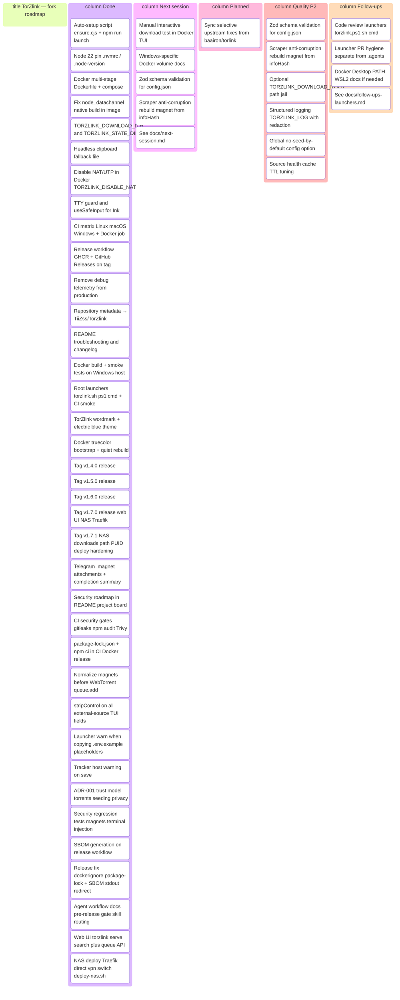

<p align="center">
  
</p>

Finding torrents has become frustrating due to misleading ads, redirects, and broken links. 

TorZlink solves this problem from the command line. With no initial setup required, it lets you search simultaneously across an indexed catalog of reputable sources. Select your file and download it directly to your local machine—cleanly, quickly, and securely.

> **This repository** — [TiiZss/TorZlink](https://github.com/TiiZss/TorZlink) is a maintained fork of [baairon/torlink](https://github.com/baairon/torlink) by [bairon (@baairon)](https://github.com/baairon). Same TUI and sources; this fork adds Docker, auto-setup for developers, CI, security hardening, and fixes for headless/container environments. **Latest release:** [v1.7.1](https://github.com/TiiZss/TorZlink/releases/tag/v1.7.1). See [Differences from upstream](#differences-from-upstream), [Acknowledgments](#acknowledgments), and the [Changelog](CHANGELOG.md).

## Get started

1. **Install Node** (from [nodejs.org](https://nodejs.org)), it's all TorZlink needs.
2. **Open your terminal.**
3. **Start it:**

   ```sh
   npx torzlink
   ```

TorZlink offers a straightforward interface based on a search bar that accepts text, magnet links, or infohashes, allowing you to explore its curated library simply by pressing Enter. Navigation is handled using intuitive keyboard shortcuts, with contextual help available at any time by pressing `?`

## Finding something

Enter your search term and press Enter. The stream of results displays the size and number of peers (seeders) for each file in real time. Select the item using the arrow keys and press `d` to download it to the default path, or `shift+d` to specify an alternative destination directory.

<p align="center">
  
</p>

## Your downloads

The interface displays active downloads at the top with real-time progress, transfer speed, and ETA metrics. Completed tasks automatically move to the "Recently downloaded" section. TorZlink features persistent session state and automatic resumption for interrupted transfers. Background downloading enables simultaneous searching and multi-file queuing. Files are routed to the default downloads directory; press `o` to reconfigure this global path, or use `shift+d` for individual destination overrides. Post-download seeding is automated to support the peer-to-peer network, with manual pause/stop controls available in the "Seeding" tab.

<p align="center">
  
</p>

## What it searches

A short, hand-picked list of trusted sources:

| Category | Sources |
| --- | --- |
| Games | FitGirl |
| Movies | YTS, The Pirate Bay, 1337x |
| TV | EZTV, The Pirate Bay, 1337x |
| Anime | Nyaa, SubsPlease |

Games are the only category that can run code, so they come from FitGirl alone, a repacker with a long, trusted track record; everything else is plain video and subtitles. If a source is down, the search carries on without it, and TorZlink tells you which one is offline.

## Differences from upstream

Fork of [baairon/torlink](https://github.com/baairon/torlink). Core behaviour (search, download, seed, UI) is unchanged unless noted.

| Area | Upstream (`baairon/torlink`) | This fork (`TiiZss/TorZlink`) |
| --- | --- | --- |
| **Run locally** | `npm install` then `npm run dev` | `npm run launch` + auto `ensure` on `dev`/`start` (Node check, install, update deps) |
| **Node version** | Documented ≥ 22 | `.nvmrc` / `.node-version` + enforced in `ensure.cjs` |
| **Docker** | Not provided | Multi-stage image, `docker-compose.yml`, `npm run docker:run` |
| **Download directory** | OS default only | `TORZLINK_DOWNLOAD_DIR` (legacy `TORLINK_*` supported) |
| **State / config dir** | `env-paths` default | `TORZLINK_STATE_DIR` override; migrates from upstream `torlink` data |
| **Clipboard (copy magnet)** | OS clipboard (`xclip`, etc.) | Same + **named `.magnet` files** in downloads when headless/Docker |
| **WebTorrent in Docker** | N/A | NAT-PMP, UPnP, uTP disabled (`TORZLINK_DISABLE_NAT` / `/.dockerenv`) |
| **Telegram** | N/A | Optional notifications via `.env`: `.magnet` attachment on copy/start; completion summary without magnet URI |
| **Self-update** | npm package update on `torlnk` binary | `torzlink` binary; `TORZLINK_SKIP_UPDATE=1` in Docker/CI |
| **Repository** | `baairon/torlink` | `TiiZss/TorZlink` |
| **Security** | Upstream baseline | P0/P1 hardening (v1.6.0): CI scans, magnet sanitization, ADR-001, SBOM on release |

Full version history: [CHANGELOG.md](CHANGELOG.md).

## Quick launch

After cloning, run the root launcher — it shows a menu to pick **native** (Node.js) or **Docker**:

| OS | Command |
|----|---------|
| Windows (double-click or cmd) | `torzlink.cmd` |
| Windows (PowerShell) | `.\torzlink.ps1` |
| macOS / Linux | `./torzlink.sh` |

```
TorZlink — launcher
  1) Native (Node.js, local development)
  2) Docker (interactive container)
  q) Exit

Choose [1/2/q]:
```

Skip the menu in scripts or CI: `./torzlink.sh --native`, `.\torzlink.ps1 -Docker`, etc.

If `.env` is missing when you pick Docker, the launcher offers to create an empty file (Telegram is optional; see `.env.example`).

On Unix, make the shell script executable once: `chmod +x torzlink.sh`.

## Contributing

To run or work on TorZlink locally:

1. Clone the repository and open the folder:

   ```sh
   git clone https://github.com/TiiZss/TorZlink
   cd TorZlink
   ```

2. **Use Node 22+** (`.nvmrc` / `.node-version` are included for nvm, fnm, or volta).
3. Launch with auto-setup (installs and updates dependencies on every start):

   ```sh
   ./torzlink.sh          # menu: native or Docker
   npm run launch         # native only
   ```

   Or the classic flow:

   ```sh
   npm install
   npm run dev
   ```

   `npm run dev` and `npm start` also run the ensure step automatically (`predev` / `prestart`), which checks Node, installs missing packages, and updates outdated ones. Set `TORZLINK_SKIP_UPDATE=1` to skip updates (useful in CI).

4. Or build it and run the bundled version:

   ```sh
   npm run build
   npx torzlink
   ```

   The `torzlink` binary checks for newer releases on startup and updates itself when possible.

Save `.env` and source files as **UTF-8** (no BOM on Windows).

### Telegram (optional)

Copy `.env.example` to `.env` and uncomment/set:

```env
TELEGRAM_ENABLED=1
TELEGRAM_BOT_TOKEN=your-bot-token
TELEGRAM_CHANNEL_ID=@your_channel
```

Do not enable Telegram with the placeholder values from `.env.example` — set your own bot token and channel.

The bot must be an **admin** of the channel to post. TorZlink notifies on magnet copy (`y`), download start (`d`), completion, and errors. Telegram failures are logged to stderr only — the TUI keeps running.

- **Copy / download start** — caption with title (and folder when known) plus a `.magnet` file attachment; the magnet URI is not pasted inline in the message.
- **Download complete** — summary only: title, folder, size, file count, elapsed time, and average speed; no magnet text.
- **Download error** — title, folder, and error message; no magnet text.

`docker-compose.yml` loads `.env` automatically via `env_file`.

### Docker

Interactive TUI (downloads persist in `./downloads`, state in a named volume):

```sh
npm run docker:run
```

(`docker:run` runs `build --quiet` then `run --rm -it` with the required TTY flags. Without `-it`, Ink cannot read keyboard input.)

Equivalent manual steps:

```sh
docker compose -f packaging/docker/docker-compose.yml build --quiet torzlink
docker compose -f packaging/docker/docker-compose.yml run --rm -it torzlink
```

**Docker Desktop:** `docker compose run --rm` creates a one-off container (name like `torzlink-torzlink-run-…`) that only appears under **Containers** while the TUI is running. When you quit or the app exits, `--rm` removes it immediately — that is expected, not a bug.

Build the image manually (tags it as `torzlink:latest`):

```sh
docker build -f packaging/docker/Dockerfile -t torzlink:latest .
docker run --rm -it \
  -e TORZLINK_STATE_DIR=/data \
  -e TORZLINK_DOWNLOAD_DIR=/downloads \
  -v torzlink-data:/data \
  -v "%cd%/downloads:/downloads" \
  torzlink:latest
```

On Linux/macOS, replace `%cd%` with `$(pwd)`.

### Web UI (`torzlink serve`)

LAN admin UI + JSON API (search + download queue). No in-app login — trust Traefik / your LAN (see [ADR-001](docs/adr/001-trust-model.md)).

```sh
torzlink serve --host 127.0.0.1 --port 8787
# or from repo: npx tsx src/app/entry.tsx serve --host 127.0.0.1 --port 8787
```

Open `http://127.0.0.1:8787`. Endpoints: `GET /health`, `GET /api/auth`, `GET /api/search?q=`, `GET|POST /api/downloads`, `POST /api/downloads/:id/pause|resume|cancel`.

On shared Docker networks, set `TORZLINK_SERVE_TOKEN` so `/api/*` requires `Authorization: Bearer …` (the UI prompts for the token).

### NAS deploy (Ugreen + Traefik v3)

**Volumes:** `/volume1` = data (downloads); `/volume2` = apps / Docker configs / deploy compose.

#### From this Windows PC (no GitHub/GHCR required)

Put NAS connection settings in the project `.env` (gitignored):

```env
NAS_HOST=ip_nas
NAS_USER=user-name
NAS_PASSWORD=your-nas-password
PROXY_NET_NAME=0-nas_proxy_net
```

Then:

```powershell
.\tools\deploy-from-dev.ps1
```

Builds `torzlink:vX.Y.Z` locally, copies it to the NAS, syncs compose/`.env` (including `TORZLINK_SERVE_TOKEN` / Telegram from the project `.env`), and runs compose there. Prefer an SSH key over storing `NAS_PASSWORD` when you can.

Bash/WSL equivalent: `NAS_USER=… PROXY_NET_NAME=… ./tools/deploy-from-dev.sh`

#### From the NAS via GHCR

```sh
# on the NAS — keep the stack under volume2
mkdir -p /volume2/docker/torzlink && cd /volume2/docker/torzlink
git clone --depth 1 --branch v1.7.1 https://github.com/TiiZss/TorZlink.git repo
cp repo/packaging/docker/.env.nas.example .env
chmod 600 .env
# set PROXY_NET_NAME, TORZLINK_IMAGE=ghcr.io/tiizss/torzlink:v1.7.1, TORZLINK_SERVE_TOKEN=…
export TORZLINK_DEPLOY_DIR=/volume2/docker/torzlink
bash repo/tools/deploy-nas.sh install
bash repo/tools/deploy-nas.sh up
```

- **`TORZLINK_NETWORK_MODE=direct`** — TorZlink on `proxy_net`; Traefik labels on the service (`Host(\`torzlink.lan\`)`).
- **`TORZLINK_NETWORK_MODE=vpn`** — `network_mode: container:gluetun`; paste labels from [packaging/docker/traefik-gluetun-torzlink.labels.md](packaging/docker/traefik-gluetun-torzlink.labels.md) onto Gluetun.

Point Pi-hole DNS `torzlink.lan` at Traefik’s LAN IP.

| Path on NAS | Role |
| --- | --- |
| `/volume2/docker/torzlink` | `.env` + deploy working dir |
| `/volume2/Docker_Configs/torzlink` | state (`queue.json`, config) → container `/data` |
| `/volume1/data/media/descargas/torrents` | downloads → container `/downloads` (`TORZLINK_DOWNLOADS_HOST`) |

**If every `*.lan` returns Traefik 404:** the Docker provider may be broken after a Docker Engine upgrade (`client version 1.24 is too old`). Fix in `/volume2/Docker_Configs/0-nas/docker-compose.yml`: use `traefik:v3.6` (or newer) and set `DOCKER_API_VERSION=1.44` on the Traefik service, then `docker compose up -d traefik`.

Before opening a PR, skim [CONTRIBUTING.md](CONTRIBUTING.md); it lays out the bar with examples from real merged PRs.

## Troubleshooting

Problems encountered while building and running this fork, and how they were fixed.

### Docker build fails: `node_datachannel.node` not found

**Symptom:** Image build or runtime error about a missing native module under `node-datachannel`.

**Cause:** `npm install --ignore-scripts` in the production deps stage skipped postinstall scripts that compile the native binary.

**Fix:** The deps stage runs `npm ci --omit=dev` **without** `--ignore-scripts`, and verifies the `.node` file exists. Rebuild:

```sh
docker compose -f packaging/docker/docker-compose.yml build --no-cache
```

### `torzlink:latest` not found

**Symptom:** `docker run torzlink:latest` fails with image not found.

**Fix:** Build first (`docker compose -f packaging/docker/docker-compose.yml build` or `docker build -f packaging/docker/Dockerfile -t torzlink:latest .`). Compose and `npm run docker:build` tag the image as `torzlink:latest`.

### `Raw mode is not supported` (Ink / stdin)

**Symptom:** App exits immediately with an Ink error about raw mode.

**Cause:** Container or pipe started **without a TTY** (`-t` / `-i`).

**Fix:** Always use interactive mode:

```sh
npm run docker:run
# or
docker compose -f packaging/docker/docker-compose.yml build --quiet torzlink
docker compose -f packaging/docker/docker-compose.yml run --rm -it torzlink
```

The app also prints this hint at startup if stdin/stdout are not TTYs.

### Logo colors look wrong in Docker (gray banding)

**Symptom:** The wordmark sheen looks washed out or gray in Docker, but correct when running natively.

**Cause:** Docker PTYs often report 256-color mode without `COLORTERM=truecolor`, so Ink/chalk quantize hex theme colors.

**Fix:** Already set in `docker-compose.yml`, the Dockerfile, and `bootstrap-terminal-env.ts` (`COLORTERM=truecolor`, `FORCE_COLOR=3`). Rebuild the image after pulling updates:

```sh
docker compose -f packaging/docker/docker-compose.yml build --quiet torzlink
```

### App crashes when starting a download in Docker (exit 139)

**Symptom:** Segfault or silent exit when adding a magnet/torrent inside Docker.

**Cause:** WebTorrent's NAT-PMP, UPnP, and uTP native bindings misbehave in restricted container networks.

**Fix:** Set `TORZLINK_DISABLE_NAT=1` (already default in `docker-compose.yml` and the Dockerfile).

### Copy magnet fails in Docker

**Symptom:** "Couldn't copy magnet" after `y`.

**Cause:** No X11 `DISPLAY`; `xclip` cannot reach a desktop clipboard.

**Fix:** Magnet text is written to **`./downloads/{torrent-name}.magnet`** on your host (sanitized title; collision adds a short info-hash suffix). In Docker there is no desktop clipboard — the `.magnet` file in `downloads` is the copy.

### Downloads not appearing on the host

**Symptom:** Download completes in the TUI but files are not in your project folder.

**Cause:** Default download path inside the container is not the mounted volume.

**Fix:** Ensure `TORZLINK_DOWNLOAD_DIR=/downloads` and mount `./downloads:/downloads` (as in `docker-compose.yml`).

### `TorZlink requires Node.js v22 or later`

**Symptom:** Ensure script exits before starting.

**Fix:** Install Node 22+ or run `nvm use` / `fnm use` (`.nvmrc` is set to `22`).

### Dependency update on every start (slow CI or Docker)

**Symptom:** `ensure.cjs` runs `npm update` when you only want to run tests.

**Fix:** `TORZLINK_SKIP_UPDATE=1` (CI and Docker already set this). Node version is still checked.

### macOS: crash when download starts (upstream behaviour)

**Symptom:** Uncaught exception related to NAT-PMP / `EADDRINUSE` on port 5350.

**Cause:** macOS `mDNSResponder` holds the NAT-PMP port; upstream disables `natPmp` on darwin only.

**Fix:** Already handled in `webTorrentClientOpts()` for `process.platform === "darwin"`. Keep Node and dependencies updated.

## Project board

Status of fork work and what comes next.



| Status | Area | Item |
| --- | --- | --- |
| ✅ Done | DevEx | Developer auto-setup (`ensure.cjs`, `predev`/`prestart`, `npm run launch`) |
| ✅ Done | Docker | Image + compose + `docker:run` with `-it` and quiet rebuild |
| ✅ Done | Docker | Env-based paths and clipboard for headless |
| ✅ Done | Runtime | WebTorrent NAT/UTP hardening in containers |
| ✅ Done | CI | Matrix Linux / macOS / Windows + Docker build + launcher smoke |
| ✅ Done | Release | Workflow (`.github/workflows/release.yml`) + **v1.7.1** |
| ✅ Done | Docs | Changelog, troubleshooting, upstream diff, security roadmap |
| ✅ Done | UX | Root launchers, TorZlink branding, truecolor in Docker |
| ✅ Done | Telegram | `.magnet` attachments on copy/start; completion summary without magnet URI |
| ✅ Done | Security | `.env.example`: Telegram vars commented by default |
| ✅ Done | Security | CI: Gitleaks + `npm audit` (critical) + Trivy fs/image |
| ✅ Done | Security | `package-lock.json` + `npm ci` in CI, release, and Docker |
| ✅ Done | Security | Magnet normalization at download boundary |
| ✅ Done | Security | `safeDisplayText()` for external-source TUI labels |
| ✅ Done | Security | Launchers warn on `.env` placeholder Telegram values |
| ✅ Done | Security | Custom tracker save warns on unknown announce hosts |
| ✅ Done | Security | ADR-001 trust model ([docs/adr/001-trust-model.md](docs/adr/001-trust-model.md)) |
| ✅ Done | Security | Regression tests for poisoned magnets and TUI injection |
| ✅ Done | Security | CycloneDX SBOM attached to GitHub Releases |
| ✅ Done | Release | v1.7.0 published — [GitHub Release](https://github.com/TiiZss/TorZlink/releases/tag/v1.7.0) + GHCR `:v1.7.0` / `:latest` |
| ✅ Done | Release | v1.7.1 — NAS `TORZLINK_DOWNLOADS_HOST` + PUID/PGID + deploy-from-dev fixes |
| ✅ Done | Docs | Agent workflow — [docs/agent-workflow.md](docs/agent-workflow.md) + `npm run pre-release` |
| ✅ Done | Product | Web UI + API (`torzlink serve`) — search + download queue |
| ✅ Done | Ops | NAS deploy — Traefik v3, `TORZLINK_NETWORK_MODE=direct\|vpn`, `tools/deploy-nas.sh` |
| 🔜 Next | QA | Manual TUI download smoke test in Docker (Windows host) — [docs/next-session.md](docs/next-session.md) |
| 🔜 Next | Docs | Windows-specific Docker volume docs |
| 🔜 Next | Quality P2 | Zod schema for `config.json` (`downloadDir`, `trackers[]`) |
| 🔜 Next | Quality P2 | Scraper anti-corruption layer: rebuild magnet from infoHash |
| 📋 Planned | Maintenance | Sync selective upstream fixes from `baairon/torlink` |
| 📋 P2 | Quality | Zod schema for `config.json` (`downloadDir`, `trackers[]`) |
| 📋 P2 | Quality | Scraper anti-corruption layer: rebuild magnet from infoHash, no raw HTML passthrough |
| 📋 P2 | Quality | Optional `TORZLINK_DOWNLOAD_ROOT` + `realpath` validation |
| 📋 P2 | Ops | Structured logging `TORZLINK_LOG` with token/magnet redaction |
| 📋 P2 | UX/Privacy | Global no-seed-by-default config option |
| 📋 Follow-ups | Launchers | Checklist in [docs/follow-ups-launchers.md](docs/follow-ups-launchers.md) |

**Priorities:** 🔜 Next = pick up here ([docs/next-session.md](docs/next-session.md)) · 📋 Planned = broader roadmap · 📋 P2 = quality/maintainability · Security P0/P1 complete as of **v1.6.0**.

**Current release:** [v1.7.1](https://github.com/TiiZss/TorZlink/releases/tag/v1.7.1) — NAS downloads path/ownership + deploy hardening.

### Cut a release

After merging to [TiiZss/TorZlink](https://github.com/TiiZss/TorZlink) `main`, bump `package.json`, `src/constants/version.ts`, and [CHANGELOG.md](CHANGELOG.md), then:

```sh
npm run pre-release    # tests, SBOM, Docker smoke — see docs/agent-workflow.md
git tag v1.8.0
git push origin v1.8.0
```

Agents: run `review-security` and `review-bugbot` before tagging; monitor the Release workflow after push ([docs/agent-workflow.md](docs/agent-workflow.md)).

The `release` workflow runs tests, publishes `ghcr.io/tiizss/torzlink:latest` and `ghcr.io/tiizss/torzlink:v1.8.0`, attaches `sbom.cdx.json`, and opens a GitHub Release with notes from [CHANGELOG.md](CHANGELOG.md).

## Acknowledgments

**TorZlink** is a maintained fork of [**torlink**](https://github.com/baairon/torlink). The original terminal torrent finder — the Ink TUI, curated sources, search-and-download flow, and overall design — was created by [**bairon** (@baairon)](https://github.com/baairon).

Thank you to bairon for open-sourcing the project and for the foundation this fork builds on. If you use TorZlink, consider starring both [this repository](https://github.com/TiiZss/TorZlink) and the [upstream project](https://github.com/baairon/torlink).

## Privacy

Your files stay on your disk, and nothing routes through a central server; TorZlink only talks to the torrent network directly. Once a download finishes it keeps seeding by default, sharing it back so the next person can find it just as easily. The network only works because people pass things along, and even a few minutes makes a real difference. If you'd rather not, opt out anytime: open the Seeding tab, press `p` to pause or stop any item, and press it again to pick it back up. Always your call.